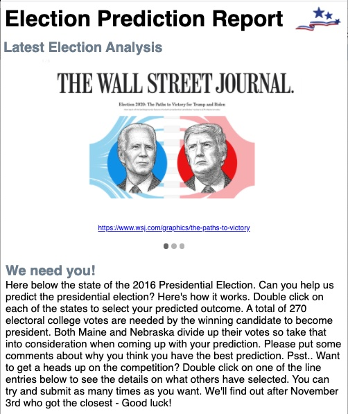
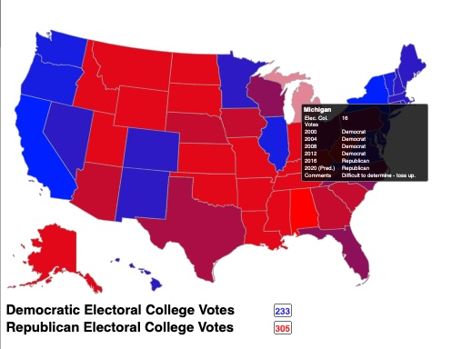
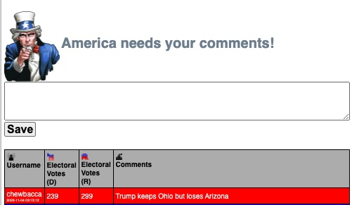
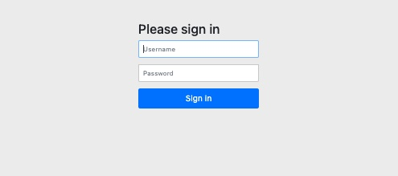
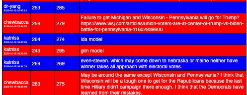

# Proof of Concept: Election Prediction Blogger
## Overview
Website to allow defined users to make a presidential election prediction and to add comments.
## Graphical Representation
Experimental usage of an interactive map of the USA where by users can click on
states to indicate their prediction.  Hovering over the sites allows
users to see statistical data about the historical state voting records.
Optimized for mobile usage.

A rotating image carousel flashes some recent headlines or statistics to 
help stir conversation.  The image changes every few seconds. 

The user can use a mouse (if accessed from the desktop) or touch on the 
screen if using a mobile touch screen device.  By double-clicking or
double-tapping the image with change color, toggling your options from either
red or blue.

The user can enter in comments to supplement their prediction forecast.

The user is presented with a login screen if they have not already signed 
into the site.

Blog entries are sorted by entry date and time with
the most recent listed at the top.